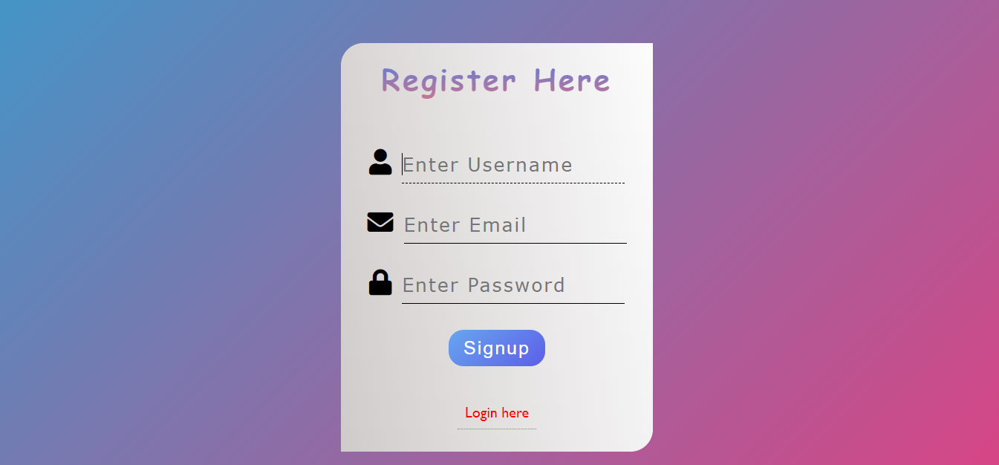
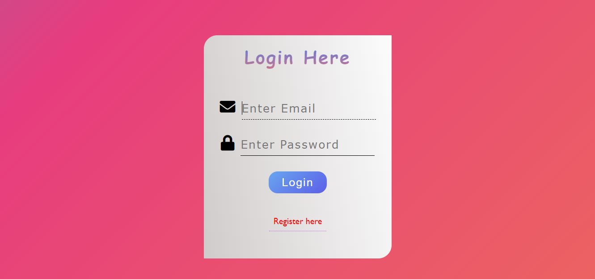

# Animated Signup & Login pages with CRUD in JavaScript

## Some Details

- User can register itself and the data will store permanently in browser local storage
- user can login using the information given during registration
- The forms has complete validations
- User can update its username
- User can delete its account permanently

### This is a complete login and signup web pages. The tools used here are:

- HTML
- CSS
- CSS Animations
- CSS Flex
- JavaScript (CRUD operatios)

### How to use this?

1. User have to signup by entering Username, Email and Password
2. User have to login using the Email and Password
3. After Login User can update its username
4. User can delete its account permanently
